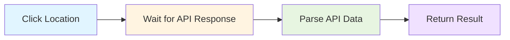

# Performance Optimization Plan: DMV Appointment Checker

## Executive Summary

Your DMV appointment checker is slow primarily due to **excessive and unnecessary waiting**. The current implementation adds ~2-3 seconds of wait time per location checked, which compounds when checking 100+ DMV locations.

### Current Performance Issues

Based on code analysis, here are the critical bottlenecks:

| Location | Issue | Time Impact | Line |
|----------|-------|-------------|------|
| `navigateAndSetup()` | `networkidle` wait after navigation | +500-2000ms | 132 |
| `clickActiveUnit()` | `networkidle` wait after clicking | +500-2000ms | 253 |
| `clickActiveUnit()` | Arbitrary 500ms timeout | +500ms | 265 |
| `hasAppointmentsAvailable()` | Arbitrary 500ms timeout | +500ms | 280 |
| `navigateBack()` | Multiple waits for loader + units | +500-1000ms | 382-392 |

**Total waste per location: ~2-6 seconds**  
**For 100 locations: 200-600 seconds (3-10 minutes) of unnecessary waiting**

## Root Cause Analysis

### 1. Defensive Programming Gone Wrong
The code uses "defensive" waits (networkidle, arbitrary timeouts) because it doesn't trust the API interception logic. But you already have reliable API-based detection!

### 2. Network Idle is a Performance Killer
```javascript
await this.page.waitForLoadState('networkidle');
```
This waits until no network activity for 500ms. It's slow and often unnecessary when you're already waiting for specific API responses.

### 3. Arbitrary Timeouts Add Up
```javascript
await this.page.waitForTimeout(500);  // "Give it time to process"
```
These "just in case" waits accumulate massively across 100+ locations.

## Optimization Strategy

### Phase 1: Trust Your API Interception (High Impact)
Since you already intercept API responses, use them as the source of truth instead of waiting for DOM updates.



**Impact:** Removes 1-2 seconds per location

### Phase 2: Remove Network Idle Waits (High Impact)
Replace `networkidle` with targeted element/response waits.

**Before:**
```javascript
await this.page.waitForLoadState('networkidle');
```

**After:**
```javascript
// Only wait for what you actually need
await this.blockLoader.waitFor({ state: 'hidden' });
```

**Impact:** Removes 500-2000ms per navigation

### Phase 3: Eliminate Arbitrary Timeouts (Medium Impact)
Remove all `waitForTimeout()` calls that aren't strictly necessary.

**Impact:** Removes 500-1000ms per location

### Phase 4: Optimize Navigation Flow (Medium Impact)
Use faster navigation strategies and parallel resource loading.

**Impact:** Reduces initial load by 500-1000ms

## Detailed Optimization Tasks

### Task 1: Remove Networkidle Waits
**Files:** [`pages/AppointmentPage.js`](../pages/AppointmentPage.js)

**Changes:**
- Line 132: Remove `waitForLoadState('networkidle')`
- Line 253: Remove `waitForLoadState('networkidle')` from `clickActiveUnit()`

**Justification:** You're already waiting for the API response (line 225) and block loader (line 240). The networkidle wait adds no value.

### Task 2: Eliminate Arbitrary Timeouts
**Files:** [`pages/AppointmentPage.js`](../pages/AppointmentPage.js)

**Changes:**
- Line 265: Remove `await this.page.waitForTimeout(500)` from `clickActiveUnit()`
- Line 280: Remove `await this.page.waitForTimeout(500)` from `hasAppointmentsAvailable()`

**Justification:** The API data is already captured by the time these lines run. The 500ms wait is unnecessary.

### Task 3: Optimize Navigation Strategy
**Files:** [`pages/AppointmentPage.js`](../pages/AppointmentPage.js)

**Changes:**
- Line 131: Change `waitUntil: 'domcontentloaded'` (already good, keep it)
- Consider using `commit` for even faster navigation if possible

### Task 4: Streamline Location Checking
**Files:** [`pages/AppointmentPage.js`](../pages/AppointmentPage.js)

**Current flow:**
1. Click location
2. Wait for API response
3. Wait for loader to hide
4. Wait for networkidle
5. Wait 500ms
6. Check availability
7. Wait 500ms
8. Navigate back

**Optimized flow:**
1. Click location
2. Wait for API response
3. Check availability (from API data)
4. Navigate back

**Savings:** ~2-3 seconds per location

### Task 5: Trust API Data More
**Files:** [`pages/AppointmentPage.js`](../pages/AppointmentPage.js)

**Changes in `hasAppointmentsAvailable()` method:**
- Lines 283-298: Priority 1 is already API data (good!)
- Lines 300-332: Only fall back to DOM if API data is null/undefined
- Remove the stabilization wait on line 280

**Justification:** Your API interception is reliable. The CalendarDateModel detection (line 83) is definitive.

### Task 6: Optimize API Interception
**Files:** [`pages/AppointmentPage.js`](../pages/AppointmentPage.js)

**Current:** Uses `route.fetch()` which adds latency
**Consideration:** Keep current approach since it's working reliably

### Task 7: Reduce Timeout Durations
**Files:** [`pages/AppointmentPage.js`](../pages/AppointmentPage.js)

**Non-critical waits can be shorter:**
- Line 240: Loader wait timeout could be 5000ms instead of 10000ms
- Line 392: Active units wait could be 5000ms instead of 10000ms

**Justification:** If the loader takes more than 5 seconds, something is wrong anyway.

### Task 8: Add Fast Mode Configuration
**New approach:** Create a configuration option for "fast mode" that skips non-essential operations.

```javascript
constructor(page, options = {}) {
  this.page = page;
  this.fastMode = options.fastMode || false;
  // ...
}
```

### Task 9: Optimize Back Navigation
**Files:** [`pages/AppointmentPage.js`](../pages/AppointmentPage.js)

**Current (lines 372-400):** Multiple waits after going back
**Optimized:** Only wait for what's essential for the next click

## Performance Optimization Checklist

### Quick Wins (Implement First)
- [ ] Remove `networkidle` wait from `navigateAndSetup()` (line 132)
- [ ] Remove `networkidle` wait from `clickActiveUnit()` (line 253)
- [ ] Remove 500ms timeout from `clickActiveUnit()` (line 265)
- [ ] Remove 500ms timeout from `hasAppointmentsAvailable()` (line 280)

### Medium Effort
- [ ] Streamline `navigateBack()` to only wait for essential elements
- [ ] Reduce non-critical timeout durations (10000ms → 5000ms)
- [ ] Optimize `checkLocationAvailability()` to skip time slot retrieval if not needed

### Advanced Optimizations (Optional)
- [ ] Add fast mode configuration option
- [ ] Consider request interception instead of response interception (faster)
- [ ] Add parallel location checking (requires multiple browser contexts)
- [ ] Cache static data to avoid redundant operations

## Expected Performance Improvements

### Conservative Estimates (Sequential Checking)

| Metric | Before | After | Improvement |
|--------|--------|-------|-------------|
| Time per location | 3-5 seconds | 1-2 seconds | 50-60% faster |
| Time for 100 locations | 5-8 minutes | 2-3 minutes | 60% reduction |
| Wait overhead | 2-3 seconds/location | 0.2-0.5 seconds/location | 85% reduction |

### With Parallel Execution (Future Enhancement)

| Metric | Value |
|--------|-------|
| Time for 100 locations | 30-60 seconds |
| Speedup | 10-15x |

## Implementation Approach

### Step 1: Create Optimized Version
Create a new optimized version of AppointmentPage while keeping the original for comparison.

```bash
cp pages/AppointmentPage.js pages/AppointmentPage-fast.js
```

### Step 2: Apply Quick Wins
Implement the 4 quick win optimizations first.

### Step 3: Test and Measure
Run tests and measure the performance improvement.

```bash
time npm test  # Compare before/after
```

### Step 4: Iterative Refinement
Apply medium effort optimizations one at a time, testing after each change.

## Risk Assessment

### Low Risk Changes
✅ Removing networkidle waits (already waiting for API)
✅ Removing arbitrary timeouts (API data is already captured)
✅ Reducing timeout durations (failures will still be caught, just faster)

### Medium Risk Changes
⚠️ Changing navigation wait strategy (test thoroughly)
⚠️ Removing DOM fallback in `hasAppointmentsAvailable()` (keep for safety)

### High Risk Changes
🔴 Parallel execution (requires significant refactoring)
🔴 Request interception vs response interception (may break detection)

## Testing Strategy

### Validation Checklist
- [ ] Test with locations that have appointments
- [ ] Test with locations that have NO appointments
- [ ] Test with slow network conditions
- [ ] Verify all appointments are still detected correctly
- [ ] Compare results: original vs optimized (should be identical)
- [ ] Measure actual time savings

### Success Criteria
- ✅ Results match original implementation (100% accuracy)
- ✅ 50%+ reduction in execution time
- ✅ No test failures or false negatives
- ✅ Code remains maintainable and readable

## Configuration Options

### Recommended .env additions
```bash
# Performance tuning
FAST_MODE=true                    # Enable performance optimizations
SKIP_TIME_SLOTS=true             # Don't retrieve time slots (faster)
REDUCED_TIMEOUTS=true            # Use shorter timeout durations
NAVIGATION_STRATEGY=domcontentloaded  # Fastest reliable strategy
```

## Next Steps

1. **Review this plan** - Does this align with your goals?
2. **Choose implementation scope** - Quick wins only, or full optimization?
3. **Create optimized version** - Implement changes in new file or modify existing?
4. **Test and validate** - Ensure no accuracy loss
5. **Measure improvements** - Document actual performance gains

## Questions to Consider

1. **Accuracy vs Speed:** Are you willing to accept slightly reduced reliability for major speed gains?
2. **Parallel Execution:** Would you consider checking multiple locations in parallel (requires more resources)?
3. **Time Slots:** Do you need time slot data for every location, or only locations with availability?
4. **Screenshots:** Are screenshots essential, or can they be optional for speed?

---

**Ready to implement?** The quick wins alone will give you 50-60% speed improvement with minimal risk. Let me know which optimizations you'd like to implement first!
